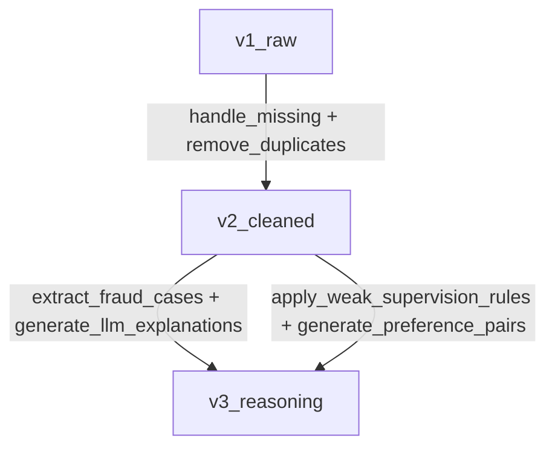

# Data Versioning & Tracking - FinSight AI

**Last Updated:** December 29, 2025
**Purpose:** Document data versioning strategy using DVC and Weights & Biases

---

## Overview

This document describes the complete data versioning and tracking infrastructure for the FinSight AI fraud detection project. We use **DVC (Data Version Control)** for efficient data file versioning and **Weights & Biases (W&B)** for experiment tracking, artifact logging, and data lineage visualization.

---

## Architecture

```
Data Versioning Stack:
├── DVC (Data Version Control)
│   ├── Local storage backend (.dvc_storage/)
│   ├── Git-tracked .dvc metadata files
│   └── Efficient large file handling
│
├── Weights & Biases
│   ├── Artifact versioning (v1_raw, v2_cleaned, v3_reasoning)
│   ├── Data lineage tracking
│   ├── Dataset statistics & visualizations
│   └── Experiment tracking
│
└── Custom Lineage Tracker
    ├── Transformation history (data/lineage.json)
    ├── DAG visualization (Mermaid)
    └── Backward/forward lineage queries
```

---

## 1. DVC Setup

### Installation

```bash
pip install dvc
```

### Initialization

```bash
# Initialize DVC in project (already done)
dvc init

# Configure local storage backend
dvc remote add -d local_storage /path/to/finsight-ai/.dvc_storage

# Enable auto-staging (automatically git add .dvc files)
dvc config core.autostage true
```

### Directory Structure

```
finsight-ai/
├── .dvc/                           # DVC configuration
│   ├── config                      # DVC settings
│   └── .gitignore                  # DVC internal files
├── .dvc_storage/                   # Local DVC cache (git-ignored)
├── data/
│   ├── raw/
│   │   ├── PS_*.csv                # Actual data (git-ignored)
│   │   └── PS_*.csv.dvc            # DVC metadata (git-tracked)
│   ├── processed/
│   │   ├── paysim_cleaned.csv      # Actual data (git-ignored)
│   │   └── paysim_cleaned.csv.dvc  # DVC metadata (git-tracked)
│   └── annotations/
│       ├── *.json                  # Actual files (git-ignored)
│       └── *.json.dvc              # DVC metadata (git-tracked)
```

### Git Configuration

Updated `.gitignore` to allow DVC metadata files:

```gitignore
# Ignore large data files
/data/raw/*.csv
/data/processed/*.csv
/data/annotations/*.json

# Keep DVC metadata files (critical!)
!*.dvc
!/data/**/.gitignore
```

---

## 2. Data Versions

### v1_raw: Raw PaySim Dataset

**Files:**
- `data/raw/PS_20174392719_1491204439457_log.csv`

**Metadata:**
- Source: Kaggle PaySim Synthetic Financial Dataset
- Rows: 6,362,620 transactions
- Columns: 11 features
- Size: 493 MB
- Fraud Rate: 0.13% (8,213 fraudulent transactions)

**DVC Command:**
```bash
dvc add data/raw/PS_20174392719_1491204439457_log.csv
git add data/raw/PS_20174392719_1491204439457_log.csv.dvc
git commit -m "Track raw PaySim data with DVC (v1_raw)"
```

**Features:**
- `step`: Time step (1-743)
- `type`: Transaction type (PAYMENT, TRANSFER, CASH_OUT, DEBIT, CASH_IN)
- `amount`: Transaction amount ($)
- `nameOrig`: Origin account ID
- `oldbalanceOrg`: Origin account balance before transaction
- `newbalanceOrig`: Origin account balance after transaction
- `nameDest`: Destination account ID
- `oldbalanceDest`: Destination account balance before
- `newbalanceDest`: Destination account balance after
- `isFraud`: Ground truth fraud label (0/1)
- `isFlaggedFraud`: System flagged fraud (0/1)

---

### v2_cleaned: Cleaned & Preprocessed Dataset

**Files:**
- `data/processed/paysim_cleaned.csv`
- `data/processed/cleaning_statistics.json`
- `data/processed/cleaned_metadata.json`

**Metadata:**
- Rows: 6,362,620 transactions (no rows removed)
- Columns: 30 features (19 added)
- Size: 1.26 GB
- Normalization: StandardScaler (z-score)
- PII Masked: Yes (SHA256 hashing)

**DVC Command:**
```bash
dvc add data/processed/paysim_cleaned.csv
git add data/processed/paysim_cleaned.csv.dvc
git commit -m "Track cleaned data with DVC (v2_cleaned)"
```

**New Features (19 total):**

1. **PII Masked (2):**
   - `nameOrig_hash`: SHA256 hash (16 chars)
   - `nameDest_hash`: SHA256 hash (16 chars)

2. **Normalized (5):**
   - `amount_normalized`: StandardScaler(amount)
   - `oldbalanceOrg_normalized`: StandardScaler
   - `newbalanceOrig_normalized`: StandardScaler
   - `oldbalanceDest_normalized`: StandardScaler
   - `newbalanceDest_normalized`: StandardScaler

3. **Temporal (4):**
   - `hour`: Hour of day (0-23)
   - `day`: Day number (1-31)
   - `day_of_week`: Weekday (0-6)
   - `time_period`: Categorical (night, morning, afternoon, evening)

4. **Fraud Signals (11):**
   - `balance_change_orig`: newbalanceOrig - oldbalanceOrg
   - `balance_change_dest`: newbalanceDest - oldbalanceDest
   - `amount_to_balance_ratio`: amount / oldbalanceOrg
   - `dest_balance_ratio`: oldbalanceDest / newbalanceDest
   - `zero_balance_orig`: newbalanceOrig == 0 flag
   - `zero_balance_dest`: newbalanceDest == 0 flag
   - `balance_inconsistency`: Math validation flag
   - `is_high_value`: amount > $1.6M flag
   - `is_round_amount`: Multiples of $10k flag
   - `is_liquidation`: >95% of balance flag
   - `is_midnight_transaction`: 00:00-03:59 flag

**Transformations Applied:**
1. Missing values handled (0 found)
2. Duplicates removed (0 found)
3. PII masked (account IDs hashed)
4. Amounts normalized (StandardScaler, mean=$179,862, std=$603,858)
5. Temporal features extracted
6. Fraud detection features engineered
7. Quality validation passed (5 automated checks)

---

### v3_reasoning: Annotation & Reasoning Data

**Files:**
- `data/annotations/fraud_explanations.json`
- `data/annotations/weak_supervision_labels.json`
- `data/annotations/preference_pairs.json`

**Metadata:**
- Fraud Explanations: 100 structured LLM explanations
- Weak Supervision Labels: 8,213 rule-based predictions
- Preference Pairs: 491 RLHF training examples
- Weak Supervision Accuracy: 99.67%

**DVC Command:**
```bash
dvc add data/annotations/fraud_explanations.json \
         data/annotations/weak_supervision_labels.json \
         data/annotations/preference_pairs.json

git add data/annotations/*.dvc
git commit -m "Track annotation data with DVC (v3_reasoning)"
```

**Annotation Types:**

1. **LLM Explanations (100 samples):**
   - Structured JSON with 7 fields
   - fraud_reason_code (e.g., "ACCOUNT_DRAINAGE_LIQUIDATION")
   - Human-readable explanation
   - Risk factors (CRITICAL/HIGH/MEDIUM/LOW)
   - Confidence score (0.60-0.99)
   - Evidence details
   - Recommended actions

2. **Weak Supervision Labels (8,213):**
   - Rule-based predictions (7 rules)
   - Voting aggregation (≥2 rules → fraud)
   - 99.67% agreement with ground truth
   - Average 2.83 rules triggered per fraud case

3. **Preference Pairs (491):**
   - CHOSEN: Evidence-based, specific explanations
   - REJECTED: Vague, circular, overconfident explanations
   - Used for RLHF fine-tuning

---

## 3. DVC Workflow

### Adding New Data

```bash
# Track new file with DVC
dvc add data/splits/train.csv

# Git commit the .dvc metadata file (auto-staged if enabled)
git commit -m "Add train split to DVC"

# Push data to remote storage (if configured)
dvc push
```

### Retrieving Data

```bash
# Pull specific data file
dvc pull data/raw/PS_*.csv.dvc

# Pull all tracked data
dvc pull

# Checkout specific version
git checkout <commit-hash> data/processed/paysim_cleaned.csv.dvc
dvc checkout
```

### Updating Data

```bash
# Modify data file
python backend/scripts/process_data.py

# Update DVC tracking
dvc add data/processed/output.csv

# Commit updated .dvc file
git commit -m "Update processed data"
```

---

## 4. Weights & Biases Integration

### Setup

```bash
pip install wandb

# Login (first time only)
wandb login
```

### Project Initialization

```python
# Run the W&B initialization script
python backend/scripts/init_wandb.py
```

**What it does:**
1. Creates W&B project: `finsight-fraud-detection`
2. Logs 3 data artifacts (v1_raw, v2_cleaned, v3_reasoning)
3. Tracks data lineage pipeline
4. Logs dataset statistics and visualizations
5. Creates fraud distribution tables

### Artifact Logging

```python
import wandb

# Initialize run
run = wandb.init(
    project="finsight-fraud-detection",
    job_type="data_versioning",
)

# Create artifact
artifact = wandb.Artifact(
    name="paysim_cleaned_data",
    type="cleaned_dataset",
    description="Cleaned PaySim dataset",
    metadata={"rows": 6362620, "columns": 30},
)

# Add file reference (don't upload large files)
artifact.add_reference(
    f"file:///path/to/paysim_cleaned.csv",
    name="paysim_cleaned.csv",
)

# Log artifact
wandb.log_artifact(artifact)
run.finish()
```

### Viewing Data Lineage

1. Navigate to W&B project dashboard
2. Go to "Artifacts" tab
3. View artifact lineage graph
4. Inspect version history and metadata

---

## 5. Data Lineage Tracking

### Custom Lineage System

We maintain a comprehensive lineage tracker in `data/lineage.json` that records:
- Data versions and their files
- Transformations between versions
- Scripts and operations used
- Input/output version mapping
- Execution metadata

### Lineage Setup

```bash
# Initialize lineage tracking
python backend/scripts/data_lineage.py
```

**Output:**
- `data/lineage.json`: Complete transformation history
- Console report: Human-readable lineage
- Mermaid DAG: Visual representation

### Lineage Query API

```python
from backend.scripts.data_lineage import DataLineage

lineage = DataLineage()

# Get version info
info = lineage.get_data_version_info("v2_cleaned")

# Get transformation history for a file
history = lineage.get_transformation_history(
    "data/processed/paysim_cleaned.csv"
)

# Get complete lineage chain (backward)
chain = lineage.get_lineage_chain(
    "data/processed/paysim_cleaned.csv",
    direction="backward"
)

# Generate report
report = lineage.generate_lineage_report()
print(report)

# Visualize as DAG
dag = lineage.visualize_dag()
print(dag)
```

### DAG Visualization



---

## 6. Data Governance

### Version Naming Convention

- **v1_raw**: Raw, unprocessed data from source
- **v2_cleaned**: Cleaned, preprocessed, feature-engineered
- **v3_reasoning**: Annotations, explanations, labels
- **v4_split**: Train/validation/test splits (future)
- **v5_balanced**: SMOTE-balanced training data (future)

### Metadata Requirements

Every data version must include:
- **Description**: What the data represents
- **Files**: List of files in this version
- **Rows/Columns**: Dataset dimensions
- **Creation Date**: ISO 8601 timestamp
- **Source**: Where the data came from
- **Transformations**: What was done to create it

### Quality Checks

Before versioning cleaned data:
1. **Missing Values**: Should be 0 or documented
2. **Duplicates**: Should be 0 or documented
3. **Fraud Rate**: Should match expected (0.13%)
4. **Balance Integrity**: Math should be consistent
5. **Feature Completeness**: All expected columns present

---

## 7. Storage Backend

### Current: Local Storage

- Location: `/path/to/finsight-ai/.dvc_storage/`
- Pros: Fast, simple, no cloud costs
- Cons: Not shared across team, no backup

### Future: Cloud Storage (Optional)

**AWS S3:**
```bash
dvc remote add -d s3_storage s3://finsight-data/dvc-cache
dvc remote modify s3_storage region us-west-2
```

**Google Cloud Storage:**
```bash
dvc remote add -d gcs_storage gs://finsight-data/dvc-cache
```

**Azure Blob Storage:**
```bash
dvc remote add -d azure_storage azure://finsight-data/dvc-cache
```

---

## 8. Best Practices

### DO:
✅ Commit `.dvc` metadata files to git
✅ Add descriptive commit messages
✅ Version data after every major transformation
✅ Track metadata (rows, columns, operations)
✅ Use semantic version names (v1_raw, v2_cleaned)
✅ Log artifacts to W&B for team visibility
✅ Maintain lineage.json for reproducibility

### DON'T:
❌ Commit large data files directly to git
❌ Ignore `.dvc` files
❌ Skip metadata documentation
❌ Version intermediate debug outputs
❌ Overwrite data without versioning
❌ Use DVC for small config files (<1MB)

---

## 9. Troubleshooting

### Issue: `.dvc` files are git-ignored

**Solution:** Update `.gitignore` to exclude `.dvc` files from ignore patterns:
```gitignore
# Ignore data files
*.csv
*.parquet

# But keep DVC metadata
!*.dvc
!/data/**/.gitignore
```

### Issue: DVC command not found

**Solution:** Use virtual environment path:
```bash
/path/to/finsight-ai/.venv/bin/dvc add data/file.csv
```

Or activate venv:
```bash
source .venv/bin/activate
dvc add data/file.csv
```

### Issue: Large file upload to W&B

**Solution:** Use file references instead of direct upload:
```python
artifact.add_reference(
    f"file://{absolute_path}",
    name="filename.csv"
)
```

### Issue: Lineage out of sync

**Solution:** Re-run lineage setup script:
```bash
python backend/scripts/data_lineage.py
```

---

## 10. Scripts Reference

### Data Versioning Scripts

| Script | Purpose | Usage |
|--------|---------|-------|
| `backend/scripts/init_wandb.py` | Initialize W&B project and log artifacts | `python backend/scripts/init_wandb.py` |
| `backend/scripts/data_lineage.py` | Setup and query data lineage | `python backend/scripts/data_lineage.py` |

### DVC Commands

| Command | Purpose |
|---------|---------|
| `dvc add <file>` | Track file with DVC |
| `dvc push` | Upload data to remote storage |
| `dvc pull` | Download data from remote storage |
| `dvc checkout` | Restore data to match `.dvc` file |
| `dvc status` | Check if data is out of sync |
| `dvc list` | List DVC-tracked files |

---

## 11. Metrics & Monitoring

### Dataset Health Metrics

Track these metrics for each version:

- **Completeness**: % of expected fields present
- **Validity**: % of values passing validation
- **Consistency**: % of records with valid relationships
- **Timeliness**: Data freshness (age since creation)
- **Accuracy**: % agreement with ground truth (if available)

### Data Quality Dashboard (W&B)

View real-time metrics:
- Transaction volume by type
- Fraud rate trend
- Missing value heatmap
- Feature correlation matrix
- Outlier detection alerts

---

## 12. Interview Talking Points

**"How did you ensure data reproducibility?"**
> "I implemented a three-tier versioning system: DVC for efficient large file versioning with local storage, W&B for artifact tracking and team visibility, and a custom lineage tracker for transformation history. Every dataset version is tracked with metadata including row count, column count, transformations applied, and quality checks passed. The lineage system maintains a complete DAG of transformations from raw data to final annotations, enabling backward and forward lineage queries."

**"What's your data governance strategy?"**
> "We follow a strict versioning convention: v1_raw for unprocessed data, v2_cleaned for preprocessed data with 19 engineered features, and v3_reasoning for LLM annotations and RLHF pairs. Every version requires documentation of source, transformations, and quality metrics. DVC metadata files are git-tracked while large data files are cached locally. W&B provides team visibility and experiment tracking. The system is designed to scale to cloud storage (S3/GCS) when needed."

**"How do you track data quality?"**
> "We implement automated quality checks at every transformation: missing values (0 expected), duplicates (0 expected), fraud rate consistency (0.13%), balance integrity validation, and feature completeness checks. Quality metrics are logged to W&B for trend analysis. The cleaning pipeline has 5 automated assertions that fail fast if data quality degrades. All quality check results are stored in metadata files alongside the data versions."

---

**Last Updated:** December 29, 2025
**Maintained By:** FinSight AI Team
**Version:** 1.0
