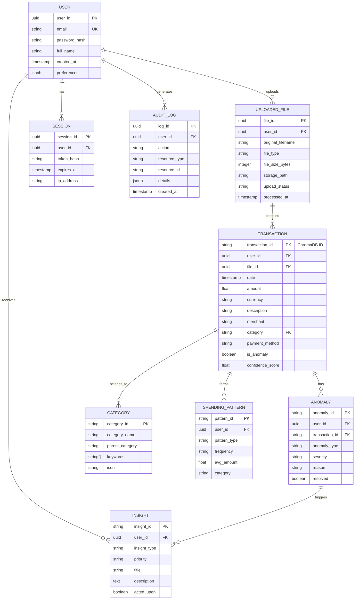

# Database Diagram - FinSight AI

This document provides a visual representation of the database schema for FinSight AI, based on the [Database Design](../architecture/database-design.md).

## Entity Relationship Diagram (ERD)

## Storage Strategy

| Component | Technology | Purpose |
|-----------|------------|---------|
| **Structured Data** | PostgreSQL / SQLite | Users, Files, Sessions, Audit Logs |
| **Vector Data** | ChromaDB | Transactions, Categories, Patterns, Insights |
| **Unstructured Data** | S3 / Local Storage | Original PDF/Image uploads |

## Key Relationships

1.  **User Ownership**: Almost all entities are linked to a `user_id` for multi-tenancy.
2.  **Document Traceability**: Transactions are linked back to the `file_id` they were extracted from.
3.  **AI Insights**: Anomalies and Patterns are derived from Transactions and can trigger Insights for the user.
