# FraudGuardian — Research Poster (Markdown Source)

**Full title:** FraudGuardian: A Multi-Agent LLM Reasoning Framework for Explainable Fraud Detection in Instant Payment Networks  

**Implementation:** FinSight AI (`finsight-ai` monorepo) — FastAPI · Next.js · LangGraph · Ollama · ChromaDB  

**Presenter / affiliation:** *(fill in)*  

Use the sections below as slide or column blocks. **Simple diagrams** are in Mermaid + ASCII for rendering or redrawing as poster figures.

---

## Abstract (short block for poster header)

Instant payment networks require **fast** decisions and **defensible** ones: regulators and customers increasingly expect **human-readable rationales**, **policy linkage**, and **data residency**. **FraudGuardian** reframes fraud screening as **multi-agent LLM reasoning** coordinated by a **LangGraph** state machine: specialized agents plan, gather evidence via **tools** (tabular risk scores, account history, **RAG** over policies), critique outputs, and emit **structured explanations**—with **local** 7B-class models (Ollama) to reduce reliance on cloud APIs. Evaluation combines **PaySim-scale** tabular modeling with **AgentBench-compatible** fraud-agent tasks; documented runs show **42.9%** task success (single-agent) on a 7-task suite alongside strong **expert** multi-step performance, plus integrated **XGBoost / LightGBM / Random Forest** baselines.

### Diagram — Abstract at a glance

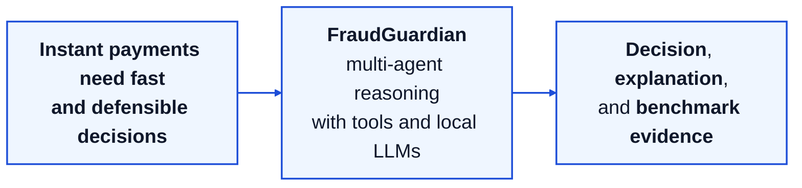

---

## Motivation

**Problem.** Instant payment rails (UPI, Pix, FedNow, RTP, Pix-style schemes) move funds in **seconds**. Fraud systems must therefore balance **detection rate**, **false positives** (customer friction and analyst load), and **governance**: GDPR-style **rights related to automated decisions**, sector-specific rules (e.g., payment and digital-lending frameworks), and internal **audit** requirements. Classical pipelines excel at **scalable scoring** but often produce **opaque points** or **static feature attributions**, not **narrative** arguments that tie a decision to **policy text** and **counterfactual context** (“why this resembles past fraud” vs. “why this is still legitimate”).

**Why multi-agent LLM reasoning?** A single prompt cannot reliably separate **data retrieval**, **rule interpretation**, **adversarial hypothesis testing**, and **final judgment**. FraudGuardian uses **explicit roles** (plan → act with tools → critique; or debate-style opposition) so traces are **modular** and easier to **review**, **replay**, and **red-team**.

**Gaps addressed by this work**

| Gap | Why it matters |
|-----|----------------|
| Black-box scores | Weak defense in disputes and regulatory review |
| Policies in PDFs vs. code | Slow change management; **RAG + citations** narrows the gap |
| Cloud LLMs | Card/PII-adjacent data and **data residency** concerns |
| FP burden | Contextual reasoning can reduce “right score, wrong story” blocks |
| No audit trail | Agents + tools yield **stepwise logs**, not only a final score |

**Research direction.** Combine **deterministic orchestration** (LangGraph), **tool-grounded** ReAct-style loops [1], **hierarchical memory** to manage context cost, and **local inference** so a review tier can run **inside** the institution’s perimeter. FraudGuardian targets **explainability-by-design** without pretending latency matches a **pure vector-score** path—**tiered** deployment (fast score → deep agent) is assumed for production.

**Operational framing (instant payments).** Throughput and p95 latency targets are **tier-dependent**: real-time **decline/allow** may still rely on lightweight models; FraudGuardian fits **high-value**, **ambiguous**, or **policy-sensitive** cases where **minutes** of agent time are acceptable for **analyst-grade** output.

### Diagram — Motivation pressures

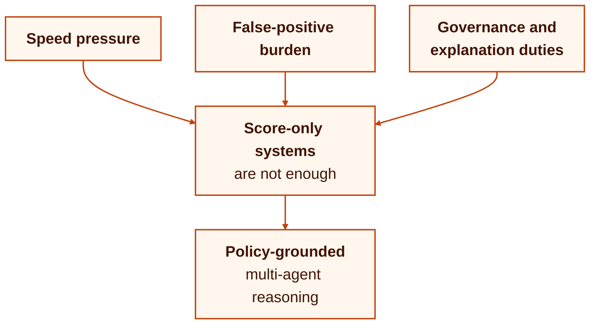

---

## Background

**Traditional ML.** Gradient-boosted trees (XGBoost, LightGBM) and forests remain strong baselines on tabular fraud features; explainability is often **post hoc** (SHAP [8], feature importance) rather than **generative rationales** [7], [13]. Graph and anomaly survey work informs **behavioral** and **network** signals [9].

**LLMs in finance.** Finance-aware LMs (FinGPT [4], BloombergGPT [5]) show domain pretraining helps; **agent** benchmarks (AgentBench [2]) show that **general** agent success rates for frontier models are still modest on **broad** task suites—supporting **specialized** agents and **tool use** (ReAct [1]) for a narrow domain like fraud.

**Multi-agent patterns.** Debate and knowledge-elicitation setups illustrate how **competing** hypotheses can improve robustness [3]. Industry-oriented work on **mobile payment fraud** motivates **real-time** and **graph** concerns [10].

**Synthetic simulators.** PaySim [6] is a standard academic benchmark; results must be interpreted with care regarding **real-world drift** and **adversarial evolution** of fraud.

**Regulatory & fairness framing.** Automated decisions face scrutiny under **explanation** norms [11]; **fairness** metrics and constraints apply to any score or agent policy [12].

### Diagram — Background strands

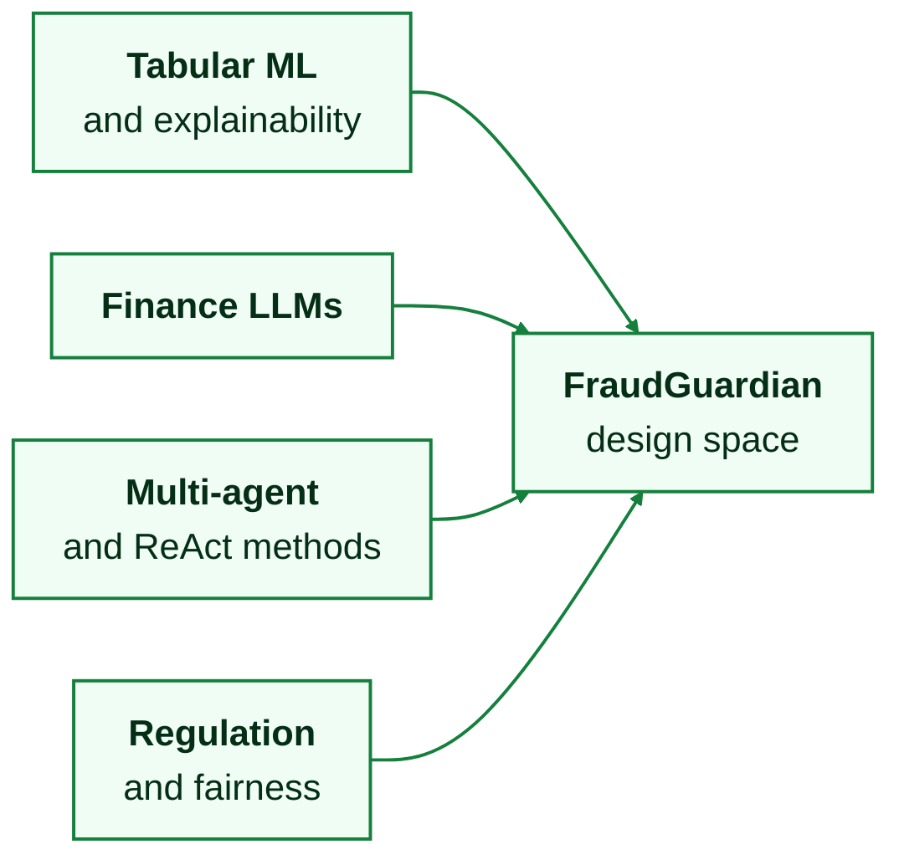

---

## Methodology (FraudGuardian framework)

**Core idea.** **FraudGuardian** is not “one LLM answers yes/no.” It is a **framework** for composing **agents**, **memory tiers**, **tools**, and **safety** checks so each decision is backed by **retrieved facts**, **explicit reasoning**, and optional **multi-agent disagreement**.

**Stack (implemented in repo).** Next.js (dashboard, traces) → FastAPI (API gateway, validation) → **LangGraph** (orchestration) → **Ollama** (e.g., Mistral-7B, Llama-2-7B, quantized) → ChromaDB (embeddings / RAG), Redis (session / working state), PostgreSQL (structured history). Deployment patterns (e.g., Kubernetes, monitoring) are documented for **production-style** operation.

**Six coordination patterns (design space).** The architecture explores multiple patterns to trade **accuracy**, **latency**, and **cost**:

| Pattern | Role | Typical use |
|---------|------|-------------|
| Single agent | One LLM + tools | Baseline; lowest orchestration overhead |
| Manager–worker | Coordinator + specialists | Parallel subtasks |
| **Planner–executor–critic (PEC)** | Plan → act → critique loop | Strong **self-correction**; good production balance in narrative |
| Debate | Pro / con / judge | **Highest scrutiny** ambiguous cases |
| Role-specialized | Analyst / auditor / advisor | Clear separation of duties |
| Swarm | Decentralized consensus | Robustness to single-agent failure |

**Five-tier memory.** Bound prompt size and separate concerns: **Sensory** (current txn) → **Working** (session / Redis) → **Episodic** (entity history) → **Semantic** (typologies, embeddings) → **Institutional** (regulatory and policy corpora via RAG). This structure targets **~40% token savings** vs. flat dumps in the thesis narrative—important at scale.

**Prompting (conceptual).** The framework considers zero-shot, few-shot, **chain-of-thought**, **ReAct** (thought → action → observation), and **self-consistency**—with ReAct/tool use as the main bridge between **language** and **deterministic tools**.

**Tooling (representative).** `risk_score` (tabular ML), `fraud_policy` (vector / RAG retrieval), `account_history`, anomaly detection, entity lookup, `compliance_check`—with **timeouts**, **circuit breakers**, and **fallbacks** so agent reasoning degrades **safely** under partial failures.

**Safety & governance layer (conceptual).** Prompt-injection resistance, **HITL** escalation by confidence band, logging of **tool calls** and **model outputs** for audit, and bias monitoring align with **operational risk** practice.

### Diagram 1 — End-to-end flow (poster strip)

```mermaid
%%{init: {'theme':'base','themeVariables': {'fontSize':'20px','fontFamily':'Helvetica','primaryColor':'#EEF2FF','primaryBorderColor':'#4338CA','primaryTextColor':'#1E1B4B','lineColor':'#4338CA'}, 'flowchart': {'htmlLabels': true}} }%%
flowchart LR
  classDef node fill:#EEF2FF,stroke:#4338CA,stroke-width:2px,color:#1E1B4B,font-size:20px;
  TX["<b>Transaction</b>"] --> API["<b>FastAPI</b><br/>gateway"]
  API --> LG["<b>LangGraph</b><br/>FraudGuardian orchestration"]
  LG --> AG["<b>Agents</b><br/>plan, execute,<br/>critique, debate"]
  AG --> TOOLS["<b>Tools</b><br/>risk, policy RAG,<br/>history, rules"]
  TOOLS --> LLM["<b>Local LLM</b><br/>via Ollama"]
  LLM --> OUT["<b>Decision</b><br/>and reasoning trace"]
  OUT --> UI["<b>Next.js</b><br/>analyst and audit UI"]
  class TX,API,LG,AG,TOOLS,LLM,OUT,UI node;
  linkStyle default stroke:#4338CA,stroke-width:2px;
```

**ASCII variant:**

```
[Txn] -> [API] -> [FraudGuardian / LangGraph] -> [Agents + Tools] -> [Ollama]
                                                      |
                                                [Chroma / Redis / PG]
                                                      |
                                            [Decision + explanation]
```

### Diagram 2 — Planner–Executor–Critic (PEC)

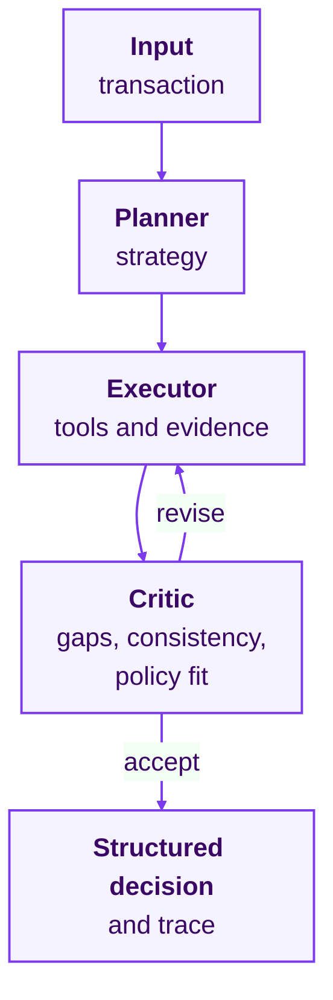

### Diagram 3 — Debate pattern (high-ambiguity lane)

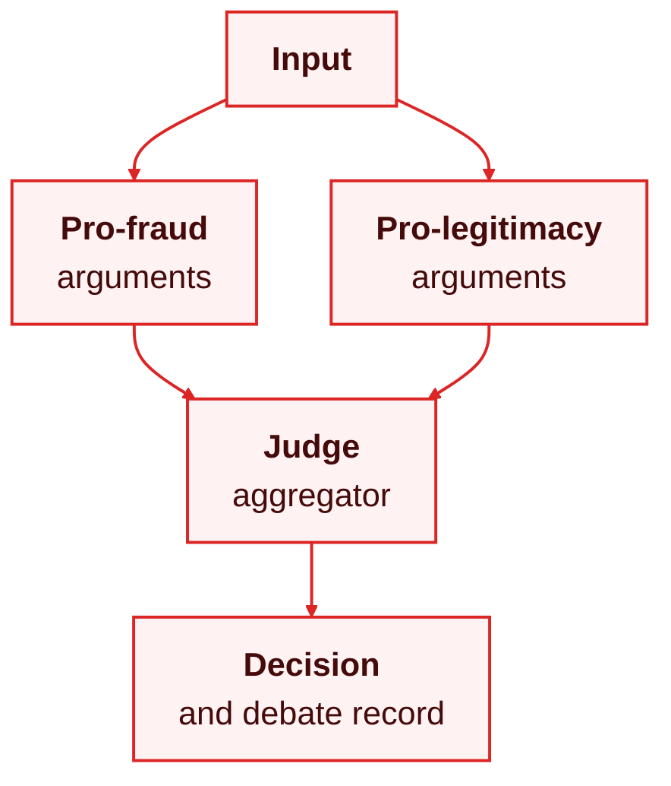

### Diagram 4 — Dual evaluation lens (tabular vs. agent)

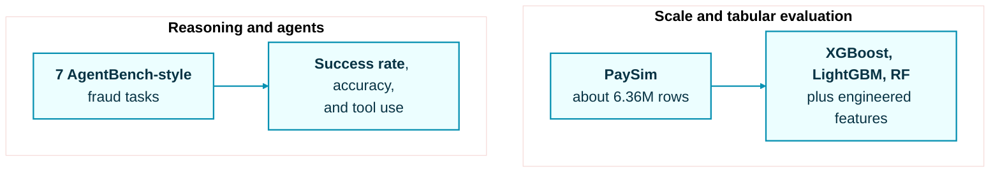

---

## Dataset

**PaySim [6].** Mobile-money **simulator** widely used in fraud ML: ~**6.36M** transactions, **~0.13%** fraud (severe **imbalance**), transaction types (e.g., PAYMENT, TRANSFER, CASH_OUT), balances, and labels. Engineered features (ratios, z-scores, velocity-style signals, time-of-day flags) support **gradient boosting** baselines and **feature supply** to agents.

**Splits.** **Stratified** splits preserve rare fraud prevalence; **temporal** splits stress **drift** (fraud rate can shift by time window in the simulator). Metrics emphasize **F1 / PR** over raw accuracy.

**Imbalance handling.** Class weights, resampling strategies (e.g., SMOTE in pipeline docs), and **threshold** tuning—standard practice for rare-event detection.

**AgentBench-style fraud tasks (custom).** Because AgentBench [2] does not include fraud, the project defines **7 JSON tasks** (easy, medium, hard, **expert**) with instructions, state, and success criteria—aligned with **agent** methodology rather than single-row classification.

### Diagram — Dataset and evaluation assets

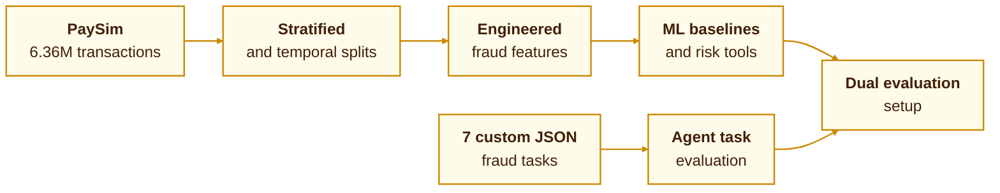

---

## Results

**Measured result sources:** AgentBench-style fraud task artifacts, backend pattern-comparison outputs, and classifier evaluation reports generated from backend benchmark and evaluation pipelines (Feb 2026).

### A. AgentBench-compatible fraud tasks (n = 7)

| Agent configuration | Success rate | Classification accuracy | Notes |
|---------------------|-------------|-------------------------|--------|
| **Single-agent (FraudGuardian / FinSight)** | **42.9%** (3/7) | 57.1% | Contextual comparison to **GPT-4 44.5%** on **different** general AgentBench tasks [2] — illustrative, not identical task distribution |
| Planner–Executor–Critic | 14.3% (1/7) | 57.1% | Lower SR linked in docs to **tool-tracking / evaluator** limitations; **same** accuracy band |

**Additional agent metrics (same run):** mean confidence ~**0.807**; **100%** on the **expert** (multi-step) task; **0%** crash rate; ~**3** tools per task on average (single-agent).

**By difficulty (single-agent, summary):** easy and medium **50%** success each (1/2); hard **0%** (0/2); expert **100%** (1/1) — indicates strength on **structured, tool-heavy** investigations vs. **adversarial** short tasks.

### B. Multi-agent pattern comparison (micro-suite, n = 3)

| Pattern | Accuracy | Precision | Recall | F1 | p95 latency | Notes |
|---------|----------|-----------|--------|----|-------------|-------|
| Single-agent | 66.7% | 1.000 | 0.500 | 0.867 | 272.5 ms | 1 TP, 1 TN, 1 FN |
| Manager-worker | 66.7% | 1.000 | 0.500 | 0.867 | 274.6 ms | Same confusion profile, slightly higher coordination overhead |

**Interpretation.** On the current **3-case** comparison slice, manager-worker does **not** outperform the single-agent baseline on accuracy or F1. A Wilcoxon test yields **p = 1.0** with **Cohen's d = 0.0**, which is useful as a sanity check but too small for strong inferential claims.

### C. Classical model evaluation (held-out slice, n = 50,000; fraud = 8)

| Model | Accuracy | Precision | Recall | F1 | ROC-AUC | PR-AUC | False positives |
|-------|----------|-----------|--------|----|---------|--------|-----------------|
| **LightGBM** | **99.998%** | **0.889** | **1.000** | **0.941** | **1.000** | **1.000** | **1** |
| Random Forest | 99.988% | 0.571 | 1.000 | 0.727 | 1.000 | 0.931 | 6 |
| XGBoost | 99.956% | 0.267 | 1.000 | 0.421 | 1.000 | 0.928 | 22 |

**Interpretation.** All three tree models recover all **8** fraud cases in this slice, but precision diverges sharply because of false positives. **LightGBM** is the strongest classical baseline in the attached evaluation artifacts, with the best F1 and only **1** false alarm across **50,000** test transactions.

### D. Operational benchmark sanity check (small crafted suite)

On a separate handcrafted benchmark suite, the **rule-based** baseline is the fastest and best small-suite operational check: **F1 = 0.889** and **p95 latency = 0.05 ms** on the **18-prediction** benchmark-suite report. On that same tiny suite, **XGBoost** and **LightGBM** each score **F1 = 0.400**. This is best interpreted as an **edge-case regression harness**, not as the primary model-quality claim.

### Diagram — Results framing

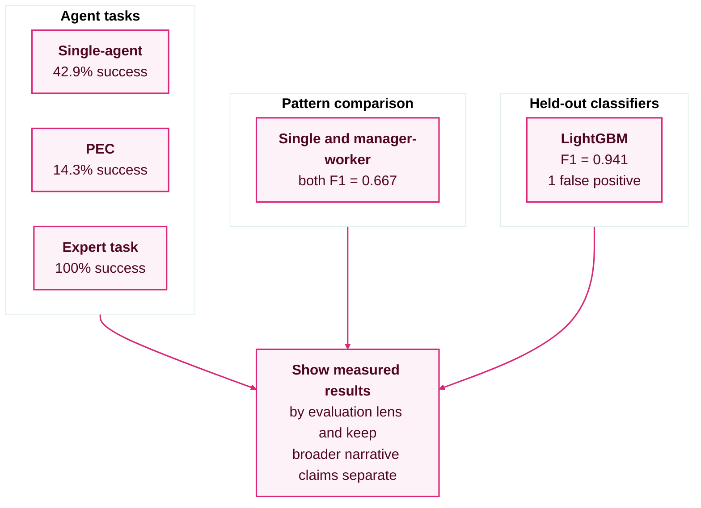

---

## Discussion

**What the evidence supports.** Local **7B** agents with **domain tools** can achieve **non-trivial** success on **fraud-specific** agent tasks and **competitive contextual** positioning vs. published **general** AgentBench numbers [2], with **zero** per-token API cost and **data-local** execution. **PEC**’s lower success rate under the current evaluator highlights that **agent quality** and **benchmark harness** must evolve together. At the same time, the held-out classifier reports show that **classical tabular models remain very strong screening baselines**, with **LightGBM** reaching **0.941 F1** and only **1** false positive in the current **50k**-transaction slice.

**Explainability vs. latency.** **Narrative traces** and **debate logs** help **HITL** and audits; they are **not** a substitute for **millisecond** scoring on every authorization. **Cascade** designs: cheap model first, FraudGuardian on **escalations**.

**Limitations.** PaySim is **synthetic** [6]. AgentBench numbers are **not** directly comparable across **task families**. **Adaptive** fraud and **label delay** in production are not fully captured. **LoRA / fine-tuning** and **GPU** scaling remain **future** levers.

**Ethics & fairness.** Monitor outcomes across **segments**; fairness frameworks [12] and **explanation** norms [11] apply to **any** automated decision path, including **LLM**-assisted ones.

**Broader impact.** FraudGuardian-style systems point toward **auditable AI** in finance: same infrastructure supports **credit**, **KYC**, and **compliance** assistants if tool interfaces are extended.

### Diagram — Deployment trade-off

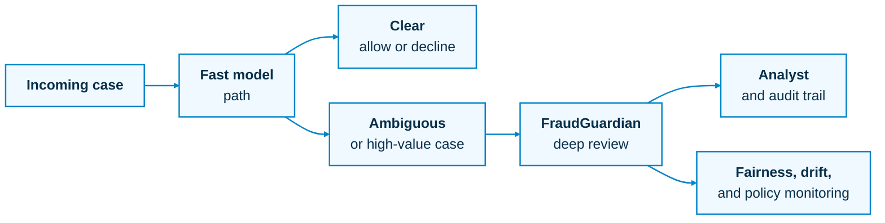

---

## Conclusion

**FraudGuardian** contributes a **unified framework** for **explainable**, **policy-aware** fraud analysis in **instant payment** contexts: **multi-agent** LangGraph orchestration, **five-tier memory**, **RAG** over institutional text, **tabular** tool integration, and **local** LLM inference. **Documented** progress now spans three measured lenses: **AgentBench-style** evaluations (**42.9%** success, single-agent, 7 tasks), a **pattern-comparison** sanity check where single-agent and manager-worker tie at **0.667 F1** on the current micro-suite, and **held-out classifier** evaluation where **LightGBM** reaches **0.941 F1** with **1** false positive across **50,000** test transactions. **Future work:** institution-specific validation, **GPU** latency, **fine-tuning**, **PEC** evaluation alignment, and **cascaded** deployment with clear **SLA** per tier.

### Diagram — Contribution map

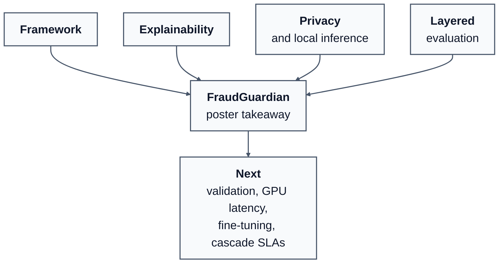

### Contribution bullets (for poster column)

1. **Framework:** Named **FraudGuardian** — multi-pattern agents + tools + memory, not a single monolithic prompt.  
2. **Explainability:** Reasoning traces, critique loops, optional **debate** for contested cases.  
3. **Privacy / ops:** Local Ollama models and **no** mandatory cloud LLM for core paths.  
4. **Evaluation:** Layered evidence — **7** custom **agent** tasks, a pattern micro-suite, and **50k-row** classifier evaluation artifacts.  
5. **Engineering:** Production-oriented API, persistence, and defensive **tool** behavior.

---

## References (from existing project paper list)

1. Yao et al. ReAct: Synergizing Reasoning and Acting in Language Models. arXiv:2210.03629, 2022.

2. Liu et al. AgentBench: Evaluating LLMs as Agents. ICLR 2024.

3. Du et al. Eliciting Latent Knowledge without Direct Input-Output Pairing. arXiv, 2023.

4. Yang et al. FinGPT: Open-Source Financial Large Language Model. arXiv:2307.10485, 2023.

5. Wu et al. BloombergGPT: A Large Language Model for Finance. arXiv:2303.17564, 2023.

6. López-Rojas et al. PaySim: A Financial Mobile Money Simulator for Fraud Detection. ECMS 2016.

7. Wang et al. Explainable Deep Learning Models in Medical Image Analysis. IEEE TMI, 2021.

8. Lundberg & Lee. A Unified Approach to Interpreting Model Predictions (SHAP). NeurIPS 2017.

9. Akoglu et al. Graph based anomaly detection and description: a survey. DMKD 2015.

10. Merchant et al. Detecting Fraud in Mobile Payment Networks. ACM SIGMOD Record, 2016.

11. Goodman & Flaxman. EU regulations on algorithmic decision-making and a “right to explanation.” AI Magazine, 2017.

12. Hardt et al. Equality of Opportunity in Supervised Learning. NeurIPS 2016.

13. Chen & Guestrin. XGBoost: A Scalable Tree Boosting System. KDD 2016.

14. Devlin et al. BERT. NAACL 2019.

15. Brown et al. Language Models are Few-Shot Learners (GPT-3). NeurIPS 2020.

16. Touvron et al. Llama 2: Open Foundation and Fine-Tuned Chat Models. arXiv:2307.09288, 2023.

17. Jiang et al. Mistral 7B. arXiv:2310.06825, 2023.

18. Reserve Bank of India. Framework for Digital Lending (notification), 2023.

19. European Commission. General Data Protection Regulation (GDPR), 2016.

20. Bergstra et al. Hyperband. JMLR 2013.

---

## Optional: figure prompts (image generation)

- **Hero:** Title **FraudGuardian** over a split panel: left “instant payment network” abstract map; right “agent swarm + shield.”  
- **Figure A:** Horizontal pipeline: transaction → API → LangGraph → agents → tools/DB → **explanation panel** with citation snippets.  
- **Figure B:** PEC triangle (Plan → Execute → Critique) with a “revise” loop.  
- **Figure C:** Two columns: **PaySim** volume / imbalance iconography vs **7-task** agent benchmark bar chart.  
- **Figure D:** Five-tier memory as a vertical stack (Sensory → … → Institutional) with arrows for “hot → cold” storage.

---

*FraudGuardian framework · FinSight AI implementation · aligns `proposal/RESEARCH_PAPER_COMPLETE.md` with `EVALUATION-FINDINGS-SUMMARY.md` measured benchmarks.*
