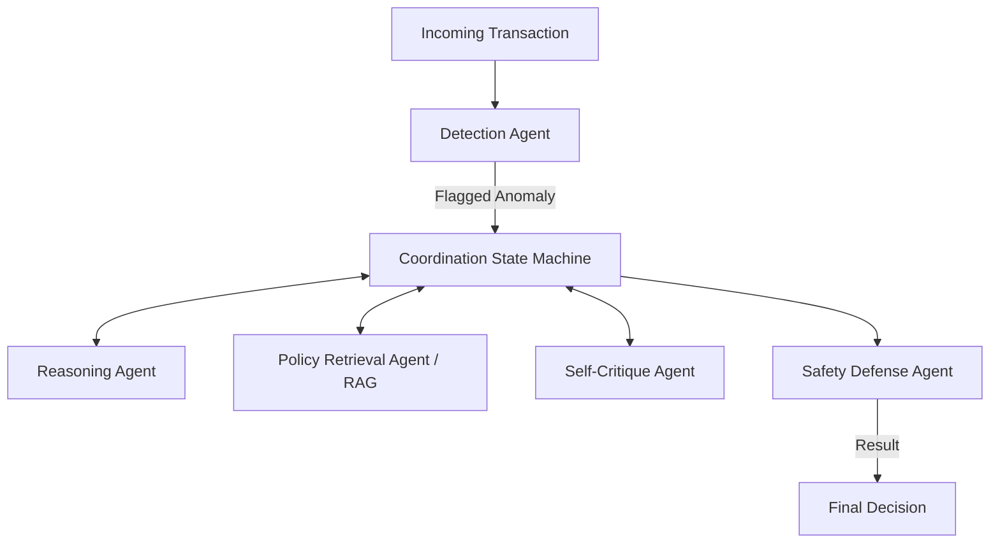
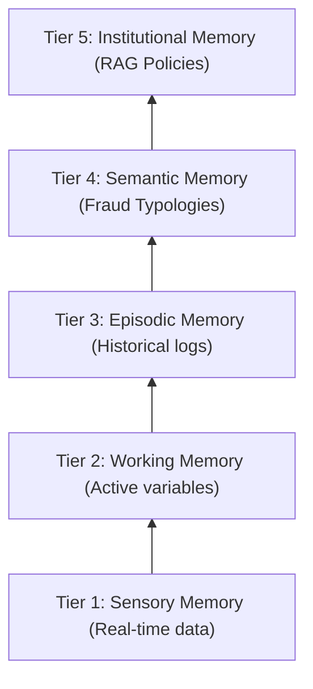

# Poster Presentation Content: FraudGuardian

## 1. Title & Header Section
- **Title:** FraudGuardian: A Multi-Agent LLM Reasoning Framework for Explainable Fraud Detection in Instant Payment Networks
- **Presenter:** Bibek Gupta
- **Institution/Department:** [Your University/Department Name]
- **Contact Information:** [Your Email / LinkedIn / Website or QR Code]

---

## 2. Abstract / Introduction
- **Problem Statement:** Instant payment networks process transactions in milliseconds, making real-time fraud detection highly challenging. Traditional machine learning models typically treat fraud detection as a black-box binary classification problem, lacking the necessary transparency, explainability, and context-awareness.
- **The Solution:** **FraudGuardian**, a novel multi-agent LLM-based framework that transforms fraud detection into a transparent, explainable reasoning process.

---

## 3. Core Objectives
- To shift fraud detection from conventional classification to an **explainable, reasoning-driven approach**.
- To integrate real-time compliance and institutional policies directly into the decision-making loop.
- To compare and benchmark multiple multi-agent coordination strategies.
- To achieve policy-aware, context-driven reasoning using advanced memory architectures and LLMs.

---

## 4. Methodology & System Architecture
### Specialized Agent Ecosystem
FraudGuardian operates by orchestrating several specialized LLM agents, governed by a robust **Agentic Coordination State Machine (implemented via LangGraph)**:

- **Detection Agent:** Scans for initial transactional anomalies.
- **Reasoning Agent:** Performs deep behavioral analysis to understand the *why* behind the anomaly.
- **Policy Retrieval Agent (RAG):** Dynamically fetches relevant regulations and institutional policies via Retrieval-Augmented Generation.
- **Self-Critique Agent:** Reviews the reasoning outputs to challenge assumptions and reduce false positives.
- **Safety Defense Agent:** Ensures the final decisions and actions strictly adhere to system safety and ethical guardrails.

### Five-Tier Hierarchical Memory Architecture
To enable deep, context-aware reasoning, the framework leverages a newly introduced five-tier memory system:

1. **Tier 1 (Sensory/Immediate):** Real-time transaction parameters and raw inputs.
2. **Tier 2 (Working Memory):** Active state variables shared across the agent state machine during a single evaluation.
3. **Tier 3 (Episodic Memory):** Historical interaction logs and past transaction contexts for individual entities.
4. **Tier 4 (Semantic Memory):** Abstracted knowledge of known fraud typologies, behaviors, and network-wide patterns.
5. **Tier 5 (Institutional Memory):** Long-term, RAG-integrated data representing static regulations and corporate policies.

---

## 5. Key Innovations
- **Agentic Coordination:** Deterministic orchestration of specialized agents targeting complex, non-deterministic fraud vectors.
- **Explainability by Design:** Naturally generates human-readable rationales for why a transaction was flagged or cleared.
- **Dynamic Policy Integration:** Connects real-world regulatory documents directly into the agent reasoning process.
- **Comprehensive Memory Structure:** The Five-Tier Architecture solves the LLM context-window limitation by organizing data hierarchically.
- **High-Performance Async Infrastructure:** Utilizes an asynchronous backend architecture designed specifically to mitigate LLM latency overhead and maintain high throughput.
- **Integrated MLOps & Safety Guardrails:** Features comprehensive MLflow experiment tracking alongside robust red-teaming protection, prompt injection monitoring, and strict tool sandboxing.

---

## 6. Evaluation & Results
- **Coordination Benchmarking:** Evaluated 6 diverse multi-agent coordination patterns (e.g., Debate, Role-Specialized, Swarm, Manager-Worker, Propose-Execute-Critique) with robust statistical significance testing.
- **State-of-the-Art (SOTA) Competitiveness:** Achieved a **42.9% success rate** on complex AgentBench fraud detection tasks. By leveraging this specialized domain architecture, the framework remains highly competitive with GPT-4 (44.5%), yet operates with vastly greater algorithmic efficiency using much smaller (e.g., 7B) models.
- **Explainability vs. Legacy ML:** Showcases profound improvements in **explainability and human-in-the-loop review times** compared to traditional baseline XGBoost and Random Forest ML classifiers.
- **Policy Verification:** Verified the high accuracy of the **RAG-based Policy Retrieval** agent to seamlessly substitute and execute new compliance rules on-the-fly.

---

## 7. Conclusion & Future Work
- FraudGuardian successfully demonstrates that explainable, multi-agent LLMs are viable for high-stakes, rapid financial environments.
- **Future Directions:** Advancing Kubernetes (K8s)-based deployment to minimize infrastructure latency strictly to meet Instant Payment SLAs, and incorporating dynamic adversarial agents for self-improving fraud simulations.

---

## 8. Acknowledgements / References
- [Placeholder for Advisor / Grant / Department Acknowledgement]
- [Placeholder for 2-3 key academic citations on Multi-Agent LLMs and Fraud Detection]
